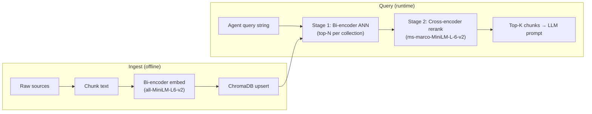

# Supply Chain Disruption Predictor — Architecture

Capstone Project 8 · Varun Mathur · Zenteiq Aitech Innovations

## Pipeline Overview

```
L1 Data Ingestion → L2 News (gpt-4.1-mini) → L3 Weather (gpt-4.1-mini)
                  → L4 Risk Classifier (3-signal ensemble + Judge)
                  → L5 Prophet (optional) → L6 Simulation (optional)
                  → L7 Mitigation (gpt-4o)
```

**Separation of concerns:** L1 fetches live data (GDELT/RSS, Open-Meteo) and writes to SQLite. L2/L3 read from SQLite and enrich with LLM + RAG — they do not call live news or weather APIs on the primary path.

## L1 — Data Ingestion

**Module:** `src/agents/data_ingestion/live_ingest.py`

| Source | SQLite table | Notes |
|--------|--------------|-------|
| Open-Meteo | `weather_signals` | One row per hub per day; rule-based severity pre-computed |
| GDELT / RSS | `news_signals` | Deduped by `content_hash`; coarse region/category tags |

## L2 — News Agent

**Module:** `src/agents/news_agent/agent.py`  
**Model:** `gpt-4.1-mini` (`MODEL_FAST`)

**Flow:**
1. Read live news from `news_signals` via `fetch_recent_news()` (L1 output — no GDELT/RSS calls)
2. Fetch `semiconductor_signals` for the order year
3. Issue 3 ChromaDB RAG queries via `build_rag_context()`
4. Call OpenAI structured output → `NewsAnalysisLLMOutput`
5. Translate to `NewsRiskSignal` list (primary + up to 3 regional signals at 0.75× severity)
6. `news_severity_component` feeds freight component (weight 0.15) in L4

**Fallback chain (when OpenAI unavailable or fails):**
1. `FALLBACK_PARAMS` dict (calibrated per disruption type; +0.05 if >5 live news rows)
2. `src.rag.agent.build_news_signals()` for unknown disruption types

## L3 — Weather Agent

**Module:** `src/agents/weather_agent/agent.py`  
**Model:** `gpt-4.1-mini`  
**HTTP client (L1 only):** `src/agents/weather_agent/client.py`

**Flow:**
1. Resolve coordinates from active record or port config
2. Find nearest semiconductor hub (12-hub map)
3. **Primary:** read `weather_signals` via `fetch_latest_weather_signal()` (L1 output)
4. **Fallback:** live Open-Meteo only when no SQLite row exists (demo/manual mode)
5. If `numeric_severity >= 0.40`, pre-fetch weather RAG context
6. LLM produces `geo_risk_component` which **overrides** numeric severity
7. `live_weather_severity` feeds geo component (weight 0.40) in L4

**Fallback:** Returns rule-based numeric severity from SQLite (or live API) unchanged when LLM fails

## L4 — Risk Classifier (Three-Signal Ensemble)

### Signal 1 — Rule-based (always runs)
- Formula: `0.4×geo + 0.3×supply + 0.15×freight + 0.15×defect`
- Delivery overrides: "Shipping canceled" → CRITICAL, "Late delivery" → HIGH
- Duration escalation: ≤1d no change, 2-3d +1 tier, ≥4d force CRITICAL

### Signal 2 — DistilBERT (fine-tuned, ~20ms CPU)
- Model: `fine_tuning/models/distilbert_risk_classifier/`
- 4-class softmax over LOW/MEDIUM/HIGH/CRITICAL
- Graceful skip when model not trained (`model_source="not-available-skipped"`)

### Signal 3 — GPT-4o + Two-Stage RAG
- **Stage 1:** Fine-tuned (or base) all-MiniLM bi-encoder → top-10 per collection
- **Stage 2:** Cross-encoder `ms-marco-MiniLM-L-6-v2` reranks → top-3
- Produces `LLMSignal` with label, rationale, RAG citations

### LLM-as-Judge (GPT-4o)
- Receives all 3 signals + SQLite record + semiconductor context
- Produces `JudgeVerdict` with `final_label`, `verdict_type`, `disagreement_explanation`
- Hard rule: "Shipping canceled" → CRITICAL regardless of judge output

### Final Label Fallback Chain
```
judge_verdict.final_label → llm_signal.predicted_label → rule_signal.escalated_label
critical_flag = (final_label == "CRITICAL")  # never from judge alone
```

## L7 — Mitigation Agent

**Model:** `gpt-4o`

**Flow:**
1. Receive L4 risk classification + L5 forecast + L6 simulation
2. Three two-stage RAG queries via `build_mitigation_context()`
3. LLM produces ranked actions + India sourcing + RAG citations

## RAG Package (`src/rag/`)

Retrieval-Augmented Generation supplies historical precedents, export-control policy, and India-sourcing context to LangGraph agents. The pipeline has two distinct phases: **ingest** (offline, bi-encoder embedding into ChromaDB) and **query** (online, two-stage retrieve + rerank).

### End-to-End Flow



### Ingest Pipeline (LOAD → CHUNK → EMBED → UPSERT)

Both ingest paths follow the same four stages:

| Stage | What happens |
|-------|----------------|
| **LOAD** | Read raw text from Excel, playbooks, PDF, DOCX, or TXT |
| **CHUNK** | Split into overlapping character windows (size tuned per collection) |
| **EMBED** | Bi-encoder encodes each chunk independently → 384-dim float32 vector |
| **UPSERT** | ChromaDB stores `(id, text, vector, metadata)` in an HNSW cosine index |

**Bi-encoder at ingest:** ChromaDB's `SentenceTransformerEmbeddingFunction` wraps the sentence-transformers model. Callers pass raw text to `collection.upsert(documents=[...])`; ChromaDB internally calls `embedding_fn(documents)` and persists the vectors. The same model must be used at query time so query and document vectors live in the same space.

**Embedding model resolution** (`utils.resolve_embedding_model_name()`):

1. `EMBEDDING_MODEL_PATH` env var (local path or Hugging Face repo id)
2. `fine_tuning/models/supply_chain_embeddings/` (Phase A fine-tuned bi-encoder)
3. Base `all-MiniLM-L6-v2` (fallback)

Vectors are L2-normalized (`normalize_embeddings=True`); ChromaDB uses cosine distance in `[0.0, 2.0]` (0 = identical, 2 = opposite).

### Two Corpus Paths

| Path | Module | Collection(s) | Sources |
|------|--------|---------------|---------|
| **Monolithic** | `utils.py` | `electronics_supply_chain_knowledge` | Lite Master Excel, mitigation playbooks, static PDF/DOCX in `data/raw/RAG_data/` |
| **Named** | `collections.py` | `historical_precedents`, `export_control_corpus`, `india_sourcing_corpus` | Domain TXT/PDF/DOCX under `data/raw/RAG_data/<collection_name>/` |

Named collections use per-domain chunk sizes (700 / 900 / 600 chars) for sharper or richer retrieval. The monolithic collection aggregates structured workbook rows (event profiles, semiconductor signals, mitigation guidance).

**Build commands:**

```bash
# Named collections (primary path for agents)
python scripts/build_rag_collections.py              # incremental upsert
python scripts/build_rag_collections.py --flush        # wipe + full rebuild

# Monolithic collection (built on demand by agent.py fallback if empty)
# via build_rag_corpus_complete() in utils.py
```

### Query Pipeline (Two-Stage Retrieval)

| Stage | Model | Module / function | Role |
|-------|-------|-------------------|------|
| **Stage 1** | Bi-encoder (same as ingest) | `collections.query_collection()` | Fast approximate nearest-neighbour (ANN) search; returns top-N candidates by cosine distance |
| **Stage 2** | Cross-encoder `ms-marco-MiniLM-L-6-v2` | `retriever.rerank_results()` | Scores `(query, chunk)` pairs jointly with full attention; re-sorts and keeps top-K |

**Why two stages?** The bi-encoder embeds query and document *independently* — fast over large indexes but less precise. The cross-encoder reads query + candidate together — slower but more accurate for final ranking. Agents typically retrieve top-10 (Stage 1) then rerank to top-3 (Stage 2).

**Orchestration:** `retriever.retrieve_and_rerank()` queries one or more collections (Stage 1), deduplicates hits, then calls `rerank_results()` (Stage 2). If the cross-encoder is unavailable, Stage 2 falls back to sorting by bi-encoder distance.

**Monolithic-only query:** `utils.query_chroma_rag()` performs Stage-1 bi-encoder retrieval only (no cross-encoder rerank). Used by `agent.py` for L2 news-signal fallback.

### Module Reference

| Module | Role |
|--------|------|
| `utils.py` | ChromaDB singleton client, embedding model resolution, monolithic corpus build/query |
| `collections.py` | Named collection ingest, Stage-1 `query_collection()` / `query_multi_collection()` |
| `retriever.py` | Two-stage `retrieve_and_rerank()`, `rerank_results()`, agent context builders |
| `agent.py` | L2 tertiary fallback: `build_news_signals()` via monolithic collection |

**Key functions:**

| Function | Stage | Description |
|----------|-------|-------------|
| `utils.build_chroma_complete()` | Ingest | Build monolithic collection from Excel + playbooks + static files |
| `collections.build_collection()` | Ingest | Ingest one named collection from a source directory |
| `collections.query_collection()` | Stage 1 | Bi-encoder retrieval from a single collection |
| `retriever.retrieve_and_rerank()` | Stage 1 + 2 | Full agent pipeline across multiple collections |
| `retriever.build_risk_classifier_context()` | Stage 1 + 2 | RAG context for L4 Signal 3 |
| `retriever.build_mitigation_context()` | Stage 1 + 2 | RAG context for L7 Mitigation |

### Agent → Collection Mapping

| Agent | RAG entry point | Collections queried |
|-------|-----------------|---------------------|
| L2 News (fallback) | `agent.build_news_signals()` | Monolithic (`query_chroma_rag`) |
| L3 Weather | Historical precedents (severity ≥ 0.40) | `historical_precedents` |
| L4 Risk Classifier Signal 3 | `build_risk_classifier_context()` | `historical_precedents` + `export_control_corpus` (when ECL elevated) |
| L7 Mitigation | `build_mitigation_context()` | All three named collections |

### Storage

- **Path:** `outputs/chromadb/` (SQLite + HNSW index files)
- **Client:** Process-wide singleton via `utils.get_chroma_client()` (avoids file-lock conflicts on Windows)

CLI: `python scripts/build_rag_collections.py` (delegates to `src/rag/collections.py`)

## Fine-Tuning Integration

| Phase A Output | Used By |
|----------------|---------|
| `distilbert_risk_classifier/` | Signal 2 (distilbert_signal.py) |
| `supply_chain_embeddings/` | Stage 1 RAG (`src/rag/utils.get_embedding_model()`) |
| `gpt_ft_result.json` | Optional future L2 fine-tune (not wired by default) |

After embedding fine-tuning, rebuild ChromaDB:
```bash
python scripts/build_rag_collections.py --flush
```

## Graceful Degradation

| Missing | Behavior |
|---------|----------|
| DistilBERT model | Signal 2 skipped, judge uses rules + LLM |
| OPENAI_API_KEY | Signals 3 + Judge skipped, L2/L3 use rule-based fallbacks |
| SQLite ingestion rows | L3 falls back to live Open-Meteo; L2 uses RAG + FALLBACK_PARAMS only |
| Fine-tuned embedder | Base all-MiniLM-L6-v2 for Stage 1 |
| Cross-encoder | Bi-encoder distance sort for Stage 2 |
| Hugging Face Hub TLS (corporate proxy) | Set `HF_INSECURE_SSL=1` or `INGEST_INSECURE_SSL=1` for Hub downloads; local model dirs use `local_files_only=True` |

## QA Validation

```bash
python -m pytest tests/test_risk_classifier_agent.py -v
python -m pytest tests/test_llm_agents.py -v
python -m pytest tests/test_news_weather_agents_v2.py -v
python -m pytest tests/test_ensemble_signals.py -v

# L4 risk classifier scenarios
python evaluation/qa_04_replay_mode_real_data.py
python evaluation/qa_05_live_mode_taiwan_earthquake.py

# L2/L3 enrichment layer (real DB + scenario + LangGraph slice)
python evaluation/qa_09_l2_l3_real_ingest_smoke.py
python evaluation/qa_10_taiwan_earthquake_l2_l3_scenario.py
python evaluation/qa_11_langgraph_l1_l2_l3_integration.py
```

| Script | Layer | Purpose |
|--------|-------|---------|
| `qa_09_l2_l3_real_ingest_smoke.py` | L2, L3 | Real `news_signals` / `weather_signals` SQLite reads; blocks live APIs |
| `qa_10_taiwan_earthquake_l2_l3_scenario.py` | L2, L3 | Documented Taiwan earthquake scenario (report-friendly PASS/FAIL) |
| `qa_11_langgraph_l1_l2_l3_integration.py` | L1→L2→L3 | State propagation on a real `daily_records` row |

Unit tests (`tests/test_news_weather_agents_v2.py`) cover agent contracts with mocks. QA scripts above add real-DB wiring checks and capstone evaluation artifacts — they do not replace pytest in CI.
