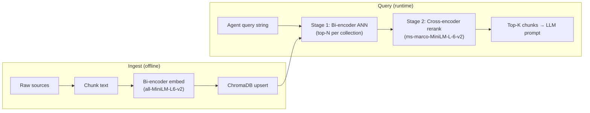

# Supply Chain Disruption Predictor — Architecture

Capstone Project 8 · Team disruptors 

---

## What This System Does

This system predicts supply chain disruptions for semiconductor components. Given a port, a SKU (e.g. `CHIP_AP`), and a disruption event date, it runs a chain of seven AI agents that produce a risk label (LOW / MEDIUM / HIGH / CRITICAL) and a ranked mitigation plan.

The core idea: **live external signals (news, weather, freight) are fetched and stored in SQLite first (L1), then LLM-powered agents read from that SQLite store to make risk assessments (L2–L7)**. No agent except L1 calls live APIs on the critical path.

---

## Full Pipeline at a Glance

```
External World
  ├── Open-Meteo (weather API)
  ├── GDELT / Google News / Reuters RSS (news APIs)
  ├── FRED (freight economic indicators)
  ├── Yahoo Finance (SOX chip price index)
  └── CISA / BIS RSS (export control alerts)
        │
        ▼
┌─────────────────────────────────────┐
│  L1 — Data Ingestion Agent          │  Fetches + stores to SQLite
│  (live_ingest.py / DataIngestionAgent)│  No LLM calls here
└─────────────────────────────────────┘
        │  SQLite: weather_signals, news_signals,
        │          live_enrichment, supplier_risk_events ...
        ▼
┌──────────────────────────┐   ┌──────────────────────────┐
│  L2 — News Agent         │   │  L3 — Weather Agent       │
│  (gpt-4.1-mini + RAG)    │   │  (gpt-4.1-mini + RAG)    │
│  Reads from news_signals │   │  Reads from weather_signals│
└──────────────────────────┘   └──────────────────────────┘
        │                               │
        └──────────────┬────────────────┘
                       ▼
        ┌──────────────────────────────┐
        │  L4 — Risk Classifier        │
        │  3-signal ensemble + Judge   │
        │  (Rule + DistilBERT + GPT-4o)│
        └──────────────────────────────┘
                       │
                       ▼
        ┌──────────────────────────────┐
        │  L5 — Prophet Forecast       │  (optional — needs prophet + pandas)
        └──────────────────────────────┘
                       │
                       ▼
        ┌──────────────────────────────┐
        │  L6 — Monte Carlo Simulation │  (optional)
        └──────────────────────────────┘
                       │
                       ▼
        ┌──────────────────────────────┐
        │  L7 — Mitigation Agent       │
        │  (gpt-4o + RAG)              │
        └──────────────────────────────┘
                       │
                       ▼
              Final GlobalState
        (risk label + mitigation plan)
```

The pipeline is orchestrated by `src/agents/langgraph_engine.py:run_agent_graph()`. Each agent reads from and writes to a shared `GlobalState` Pydantic object.

---

## L1 — Data Ingestion

L1 is split into two distinct sub-systems that serve different purposes.

### Sub-system A: Live Batch Poller (`live_ingest.py`)

**Module:** `src/agents/data_ingestion/live_ingest.py`

This is a scheduled batch job (or run manually via CLI). It calls external APIs and writes raw signals to SQLite. It does **no** LLM calls, no risk scoring — it purely transports and persists raw data.

```
CLI command:
  python -m src.agents.data_ingestion.cli            # weather + news
  python -m src.agents.data_ingestion.cli --weather  # weather only
  python -m src.agents.data_ingestion.cli --news --rss  # news + RSS fallback
```

**Weather ingestion flow:**
```
Config (ports.yaml) → for each hub city:
  1. Call Open-Meteo API (lat/lon → hourly wind, precipitation, weather codes)
  2. Compute severity factors:
       wind_score       = avg_wind / 40.0  (capped at 1.0)
       precipitation_score = avg_precip / 25.0  (capped at 1.0)
       weather_code_score = bad_code_ratio × 0.3
       severity = min(1.0, sum of above)
  3. UPSERT into weather_signals (one row per hub per day; idempotent)
```

**News ingestion flow:**
```
7 default queries (e.g. "semiconductor shortage", "Red Sea shipping crisis"):
  1. Call GDELT DOC 2.0 API → article list (title, url, seendate)
  2. If GDELT returns < 3 results → fallback to Reuters/SupplyChainDive RSS
  3. For each article: coarse-tag detected_region + detected_category via keyword match
  4. Compute content_hash (SHA-256 of url+title+date) for deduplication
  5. INSERT into news_signals (skip duplicates via content_hash constraint)
```

**SQLite tables written:**

| Table | Content |
|-------|---------|
| `weather_signals` | One row per hub per day: severity, wind/precip scores, observation_date |
| `news_signals` | Deduplicated news articles: title, url, region tag, category tag, content_hash |

---

### Sub-system B: Enhanced DataIngestionAgent v2 (`data_ingestion_agent.py`)

**Module:** `src/agents/data_ingestion_agent.py`

This is the production-grade version of L1. It runs multiple specialised connectors, validates/normalises every row, and aggregates per-port signals into a `live_enrichment` table that L1v2 overlays onto the base scenario record.

**Connectors run (in order):**

| Connector | Data Source | Writes To |
|-----------|-------------|-----------|
| `OpenMeteoEnhancedConnector` | Open-Meteo API | `weather_events` |
| `FredConnector` | FRED (freight indicators) | `freight_signals` |
| `GdeltConnector` | GDELT DOC 2.0 API | `supplier_risk_events` |
| `GoogleNewsRSSConnector` | Google News RSS | `live_news_ingest` |
| `ReutersRSSConnector` | Reuters RSS | `live_news_ingest` |
| `CisaBisRSSConnector` | CISA / BIS export control feed | `news_disruptions` |
| `YFinanceConnector` | Yahoo Finance (SOX index) | `market_demand_signals` |

**Batch run flow:**
```
DataIngestionAgent.run_batch()
  → acquires threading lock (prevents concurrent Streamlit runs)
  → for each connector:
      connector.fetch()      → raw API/RSS response
      connector.normalize()  → validated, typed rows
      connector.persist()    → INSERT OR IGNORE into target table
      _log_run()             → write to ingestion_run_log (inserted/skipped/ms/status)
  → _build_live_enrichment() for each port:
      Query latest weather, freight SDI, chip price index, market growth rate
      Count recent news events (last 7 days, capped at 17)
      Check for export control alerts (last 30 days)
      INSERT OR REPLACE into live_enrichment table
```

**Record-time enrichment flow (called during agent pipeline execution):**
```
data_ingestion_agent_v2(state, payload)
  → fetch base record from daily_records view (SQLite)
  → DataIngestionAgent.run_for_record(port, sku, date)
      → SELECT latest live_enrichment row for this port
      → mark is_consumed = 1 (best-effort)
  → overlay live signal fields onto the base record:
      weather_severity_hub    ← weather_severity_live
      natural_disaster_risk   ← natural_disaster_risk_live
      supply_disruption_index ← supply_disruption_index_live
      disruption_news_count   ← disruption_news_count_live
      chip_price_index        ← chip_price_index_live
  → identity/audit fields (delivery_status, order_id, risk_score_composite) are NEVER modified
  → store enriched record in GlobalState.active_record
```

**Key design decision:** The base record always comes from `lite_master` (historical Excel data). Live values are **overlaid** on top — they can update signal fields but cannot corrupt the historical audit trail.

**SQLite tables written (v2 only):**

| Table | Content |
|-------|---------|
| `weather_events` | Enhanced weather rows with derived severity + natural disaster risk |
| `freight_signals` | FRED freight/economic index (normalized SDI) |
| `supplier_risk_events` | GDELT-sourced supplier disruption events |
| `live_news_ingest` | Google News + Reuters articles with relevance scores |
| `news_disruptions` | CISA/BIS export control alerts |
| `market_demand_signals` | SOX chip price index + market growth rate from YFinance |
| `live_enrichment` | Aggregated per-port signal snapshot (one row per port per run) |
| `ingestion_run_log` | Audit log: connector name, rows in/skipped, duration_ms, status |

---

### L1 Fallback Chain

```
run_agent_graph() tries:
  1. data_ingestion_agent_v2()  — base record + live_enrichment overlay
        → if live_enrichment unavailable: falls back to base record only
  2. data_ingestion_agent()     — if v2 raises, legacy shim (base record only, no overlay)
```

---

## MCP Servers

The project includes two **Model Context Protocol (MCP)** servers that expose weather and news data as tool-callable APIs. Both servers use `FastMCP` (from the `mcp` package) and can run standalone over **stdio transport** for MCP-client demos.

**L1 wiring:** `DataIngestionAgent` also calls each server's underlying tool function directly, in-process, as two additional connectors — `WeatherMcpConnector` and `NewsMcpConnector` (`src/utils/ingestion_connectors.py`), registered alongside the existing hub-city connectors in `_run_all_connectors()`. This reuses `fetch_hub_weather()`/`fetch_news_headlines()` as plain Python calls rather than spawning the servers as MCP subprocesses, avoiding stdio/process-management overhead for what is otherwise an in-process batch job. Both write to the same `live_weather_ingest`/`live_news_ingest` tables as their RSS/Open-Meteo counterparts (tagged `source=weather_mcp` / `source_feed=news_mcp` in `ingestion_run_log`), so results from both paths can be compared before either RSS/Open-Meteo hub-city path is retired.

### `news_mcp.py` — Supply Chain News MCP Server

**Module:** `src/mcp_servers/news_mcp.py`  
**Server name:** `supply-chain-news`

```
Run standalone:
  python -m src.mcp_servers.news_mcp
```

**Exposed MCP tool:** `get_news_headlines`

```
Input:  query (str), hub_city, hub_country, supplier_country, max_results
Output: JSON array of articles

Flow inside the tool:
  1. Build Google News RSS URL: https://news.google.com/rss/search?q={query}
  2. feedparser.parse(url) → up to max_results entries
  3. If < 3 results → fallback: parse Reuters technology RSS, keyword-filter to query terms
  4. For each entry: compute relevance_score (hit count across 10 supply-chain keywords / 10)
  5. Return array: { headline, summary, published_at, url, relevance_score, hub_city, hub_country, supplier_country }
```

**Relevance keywords used for scoring:**
`semiconductor, chip, supply chain, disruption, factory, fab, port, export control, shortage, shutdown`

---

### `weather_mcp.py` — Supply Chain Weather MCP Server

**Module:** `src/mcp_servers/weather_mcp.py`  
**Server name:** `supply-chain-weather`

```
Run standalone:
  python -m src.mcp_servers.weather_mcp
```

**Exposed MCP tool:** `get_hub_weather`

```
Input:  city (str), lat (float), lon (float)
Output: JSON object

Flow inside the tool:
  1. Call Open-Meteo daily forecast API (1 day, UTC timezone)
     Fetches: temperature_2m_max/min, precipitation_sum, windspeed_10m_max, weathercode
  2. Compute raw_severity_score (0–10 scale):
       +4 if weather_code >= 95 (thunderstorm)
       +2 if wind >= 60 km/h  |  +1 if >= 30 km/h
       +2 if precip > 50 mm   |  +1 if > 10 mm
  3. Return: { city, latitude, longitude, wind_speed_kmh, precipitation_mm,
               weather_code, temperature_c, raw_severity_score }
```

**Note:** The MCP weather severity (0–10) is a *different scale* from the L1 batch poller severity (0.0–1.0). `WeatherMcpConnector` persists the raw 0–10 score into `live_weather_ingest` unchanged (matching `OpenMeteoEnhancedConnector`'s hub-city path); the 0–1 batch poller scale in `weather_events` is what feeds the actual risk formula in L4.

### Guardrails on ingested rows

`DataValidator` (`src/utils/ingestion_validator.py`) enforces two checks that used to be advisory-only and now actively reject data:

- **Outlier (Z-score):** `check_outlier_zscore` flags any bounded numeric field (`derived_weather_severity`, `normalized_sdi`, `normalized_chip_price_index`) whose value is `|z| > 3.0` against its table's recent history. Flagged rows are **not persisted** — they're written to `ingestion_quarantine` instead via `DataValidator.quarantine_row()`.
- **Enrichment conflict:** `check_enrichment_conflict` now returns the list of `live_enrichment` fields that shifted too sharply vs. the previous row (`weather_severity_live` > 0.5 absolute shift, `supply_disruption_index_live` > 30% relative shift). `DataIngestionAgent._build_live_enrichment()` holds back each flagged field — keeping the prior value instead of overwriting it — and quarantines the rejected value.
- **Circuit breaker:** `DataIngestionAgent._is_circuit_open()` skips a connector for one run (logged as `status=circuit_open` in `ingestion_run_log`) if its last 3 consecutive runs all failed.

Quarantined rows and circuit-breaker state are surfaced in the Streamlit "Live Data Feed" page (`src/dashboard/ingestion_dashboard.py`).

**Note on `FredConnector`:** it fetches the *entire* historical PPI CSV (back to 1974) on every run rather than incrementally — `get_last_fetched_key("fred_WPSFD4131")` never matches because runs are logged under `SOURCE_NAME = "fred"`, a pre-existing key mismatch. Combined with the outlier guardrail, older CSV rows (economically out of range vs. the recent baseline) are quarantined on every run rather than persisted once and skipped as duplicates thereafter. This doesn't affect L4 risk scoring (`_build_live_enrichment` only reads the latest `freight_signals` row), but it is wasted work worth fixing separately.

---

## L2 — News Agent

**Module:** `src/agents/news_agent/agent.py`  
**Model:** `gpt-4.1-mini`

```
Input:  GlobalState (active_record with event metadata)
Output: GlobalState.news_signals (list of NewsRiskSignal)
        GlobalState.news_analysis_llm (NewsAnalysisLLMOutput)

Flow:
  1. fetch_recent_news() → read from SQLite news_signals (L1 output; no live API calls)
  2. fetch semiconductor_signals for the order year from SQLite
  3. build_rag_context() → 3 ChromaDB RAG queries
       (historical_precedents, export_control_corpus, india_sourcing_corpus)
  4. Call OpenAI structured output → NewsAnalysisLLMOutput:
       { category, severity, affected_regions, affected_commodities,
         news_severity_component, expected_duration_days, summary, signal_tags }
  5. Translate to NewsRiskSignal list:
       - primary signal at full severity
       - up to 3 regional signals at 0.75× severity
  6. news_severity_component feeds freight component (weight 0.15) in L4 formula

  Fallback (OpenAI unavailable):
    a. FALLBACK_PARAMS — hardcoded severity per disruption type (+0.05 if >5 live news rows)
    b. src.rag.agent.build_news_signals() — RAG-only path for unknown disruption types
```

---

## L3 — Weather Agent

**Module:** `src/agents/weather_agent/agent.py`  
**HTTP client (L1 use only):** `src/agents/weather_agent/client.py`  
**Model:** `gpt-4.1-mini`

```
Input:  GlobalState (active_record with port coordinates)
Output: GlobalState.live_weather_severity (float)
        GlobalState.weather_risk_llm (WeatherRiskLLMOutput)

Flow:
  1. Resolve lat/lon from active_record or port config
  2. Find nearest semiconductor hub from 12-hub map
     (Hsinchu, Tainan, Osaka, Austin, Shanghai, Singapore,
      Rotterdam, Incheon, Penang, Ho_Chi_Minh_City, Shenzhen, Chennai)
  3. PRIMARY: fetch_latest_weather_signal() → read weather_signals from SQLite (L1 output)
     FALLBACK: if no SQLite row → call Open-Meteo live API directly (demo/manual mode only)
  4. If numeric_severity >= 0.40 → pre-fetch weather RAG context (historical_precedents)
  5. Call LLM → WeatherRiskLLMOutput:
       { event_classification, geo_risk_component, affected_semiconductor_hubs,
         supply_chain_narrative, rag_escalation_warranted }
  6. LLM geo_risk_component OVERRIDES numeric severity from SQLite
  7. live_weather_severity feeds geo component (weight 0.40) in L4 formula

  Fallback (LLM unavailable): raw numeric severity from SQLite (or live Open-Meteo) returned unchanged
```

---

## L4 — Risk Classifier (Three-Signal Ensemble)

**Module:** `src/agents/risk_classifier_agent/agent.py`

L4 combines three independently-run signals and an LLM judge to produce a final risk label.

### Signal 1 — Rule-Based (always runs)

```
Composite score = 0.4×geo + 0.3×supply + 0.15×freight + 0.15×defect
  where:
    geo      = live_weather_severity (from L3)
    freight  = news_severity_component (from L2)
    supply   = supply_disruption_index from active_record
    defect   = defect_rate from active_record

Delivery status overrides (applied before duration escalation):
  "Shipping canceled" → CRITICAL
  "Late delivery"     → HIGH

Duration escalation matrix:
  ≤1 day   → no change
  2–3 days → +1 tier
  ≥4 days  → force CRITICAL
```

### Signal 2 — DistilBERT (fine-tuned, ~20ms CPU)

```
Model: fine_tuning/models/distilbert_risk_classifier/
Input: feature vector built from active_record fields
Output: 4-class softmax over LOW / MEDIUM / HIGH / CRITICAL
```

### Signal 3 — GPT-4o + Two-Stage RAG

Uses the same two-stage retrieval pipeline described in the RAG Package section below (bi-encoder top-10 → cross-encoder rerank to top-3).

```
LLM produces LLMSignal:
  { predicted_label, rationale, rag_citations, confidence_level, primary_driver }
```

### LLM-as-Judge (GPT-4o)

```
Receives: all 3 signals + SQLite active_record + semiconductor context
Produces: JudgeVerdict:
  { final_label, verdict_type, reasoning, signals_agreed, disagreement_explanation, final_critical_flag }

verdict_type options:
  "unanimous"          — all 3 signals agree
  "majority_rule"      — 2 of 3 agree
  "override_distilbert"— judge overrides Signal 2
  "override_llm"       — judge overrides Signal 3
  "defer_to_rules"     — falls back to Signal 1

Hard rule: "Shipping canceled" → CRITICAL regardless of judge output
```

### Final Label Fallback Chain

```
judge_verdict.final_label
  → llm_signal.predicted_label      (if judge unavailable)
    → rule_signal.escalated_label   (if LLM unavailable)

critical_flag is set only when final_label == "CRITICAL"
(never set from judge verdict alone — requires hard rule to trigger)
```

---

## L5 — Demand Forecasting (Optional)

**Module:** `src/agents/langgraph_engine.py:demand_forecasting_agent()`

Skipped automatically if `prophet` or `pandas` are not installed, or if fewer than 10 historical data points exist for the port/SKU.

```
Flow:
  1. fetch_time_series(port, sku) → list of { event_date, demand } rows
  2. Fit Prophet model on historical demand
  3. Forecast 30 days ahead
  4. Compute expected_drop_pct = 1 - (forecast[-1].yhat / demand_baseline)
  5. Store in GlobalState.forecast_result
```

---

## L6 — Monte Carlo Simulation (Optional)

**Module:** `src/agents/langgraph_engine.py:simulation_agent()`

A deterministic approximation (no actual Monte Carlo sampling) that estimates stockout risk from inventory levels and composite risk score.

```
stockout_probability = composite_score × 100
                     + (1 - inventory/incoming) × 25
                     + (lead_time_days/30) × 25
                     (capped at 100%)

Output: GlobalState.simulation_result
  { stockout_probability_pct, expected_inventory_gap_pct, alternate_route }
```

---

## L7 — Mitigation Agent

**Module:** `src/agents/mitigation_agent.py`  
**Model:** `gpt-4o`

```
Input:  L4 risk classification + L5 forecast + L6 simulation results
Output: GlobalState.mitigation_action (MitigationAction)

Flow:
  1. build_mitigation_context() → three two-stage RAG queries across all named collections
       (historical_precedents, export_control_corpus, india_sourcing_corpus)
  2. LLM produces MitigationLLMOutput:
       { summary, ranked_actions (3-5), cost_estimate, urgency, rag_citations, india_sourcing_recommendations }
```

---

## RAG Package (`src/rag/`)

Retrieval-Augmented Generation supplies historical precedents, export-control policy, and India-sourcing context to LangGraph agents. The pipeline has two distinct phases: **ingest** (offline, bi-encoder embedding into ChromaDB) and **query** (online, two-stage retrieve + rerank).

### End-to-End Flow



### Ingest Pipeline (LOAD → CHUNK → EMBED → UPSERT)

Both ingest paths follow the same four stages:

| Stage | What happens |
|-------|----------------|
| **LOAD** | Read raw text from Excel, playbooks, PDF, DOCX, or TXT |
| **CHUNK** | Split into overlapping character windows (size tuned per collection) |
| **EMBED** | Bi-encoder encodes each chunk independently → 384-dim float32 vector |
| **UPSERT** | ChromaDB stores `(id, text, vector, metadata)` in an HNSW cosine index |

**Embedding model resolution** (`utils.resolve_embedding_model_name()`):

1. `EMBEDDING_MODEL_PATH` env var (local path or Hugging Face repo id)
2. `fine_tuning/models/supply_chain_embeddings/` (Phase A fine-tuned bi-encoder)
3. Base `all-MiniLM-L6-v2` (fallback)

### Two Corpus Paths

| Path | Module | Collection(s) | Sources |
|------|--------|---------------|---------|
| **Monolithic** | `utils.py` | `electronics_supply_chain_knowledge` | Lite Master Excel, mitigation playbooks, static PDF/DOCX in `data/raw/RAG_data/` |
| **Named** | `collections.py` | `historical_precedents`, `export_control_corpus`, `india_sourcing_corpus` | Domain TXT/PDF/DOCX under `data/raw/RAG_data/<collection_name>/` |

Named collections use per-domain chunk sizes (700 / 900 / 600 chars). The monolithic collection aggregates structured workbook rows.

### Why the Lite Master Excel Workbook Is Also Ingested Into RAG (Not Just SQLite)

The classifier (L4) and mitigation agent (L7) already read the Lite Master
data from SQLite (`active_record` / `daily_records` / `lite_master`) for
every live scenario — so it's a fair question why the same workbook is
*also* embedded into ChromaDB. The two paths answer different questions and
deliberately overlap on source file, not on content shape:

- **SQLite gives one row's exact field values for the specific order being
  processed right now** — this order's `Risk_Score_Composite`,
  `Supply_Disruption_Index`, `defect_rate`, `delivery_status`, etc. It's a
  precise, cheap, single-record lookup. There is no semantic search here —
  you already know the primary key.
- **RAG gives cross-record, aggregated, and named-precedent context that
  has no per-row equivalent in SQLite** — "what happened, on average, the
  last N times we saw a `Disruption_Event_Label` like this one," "what
  mitigation worked for that label historically," and "which specific past
  event (2011 Thailand floods, 2021 Renesas fire, ...) does this situation
  resemble." None of that is a single-row SQL lookup — it requires
  aggregating across many historical orders or doing a semantic nearest-
  neighbor match against a free-text description, which is exactly what a
  bi-encoder + cross-encoder retrieval pipeline is for.
- **`data_dictionary` and `workbook_context` (Legend) chunks exist for a
  third reason** — they document what the SQLite columns *mean*. They are
  schema metadata, not data, and have no SQLite row form at all.

In short: SQLite answers "what are this order's numbers," RAG answers
"what similar situations have we seen before, in prose an LLM can cite."
The two are complementary lookups over the same underlying spreadsheet, not
duplicate storage of the same fact.

**Exact columns read per RAG `doc_type`** (source function:
`src/rag/utils.py:_workbook_documents()`):

| `doc_type` | Source sheet | Columns read | What it captures | Granularity |
|------------|-------------|---------------|-------------------|-------------|
| `data_dictionary` | `Column Guide (Lite)` | `Column`, `Agent`, `Source Type`, `Purpose` (v3.1 appendix rows fall back to `Unnamed: 4`–`Unnamed: 7`) | Documents what each SQLite/workbook field means and which agent consumes it | One chunk per column definition |
| `workbook_context` | `Legend` | First two columns (term, definition) of each row | Glossary of workbook terms/codes | One chunk per legend entry |
| `event_profile` | `Lite Master` | `Disruption_Event_Label` (group key), `Order_Date`, `Order_Region`, `Product_Name`, `Risk_Score_Composite` (mean), `Supply_Disruption_Index` (mean), `Lead_Time_Variance_Days` (mean), `Stockout_Probability_Pct` (mean), `Alternate_Supplier_Available` (mean) | An aggregated profile per disruption label — averages/top-N across every order sharing that label | One chunk per unique `Disruption_Event_Label` (not per order) |
| `mitigation_guidance` | `Lite Master` | `Disruption_Event_Label`, `Mitigation_Recommendation` (deduplicated pairs) | Which mitigation response is historically paired with which disruption label | One chunk per unique (label, recommendation) pair |
| `semiconductor_event` | `Semiconductor Signals` | `Year`, `Country`, `Company`, `Known Disruption Event`, `Known Severity`, `Supply Disruption Index`, `Semiconductor Security Risk`, `Natural Disaster Risk`, `Factory Shutdown Risk`, `Export Control Level`, `Chip Price Index` (deduplicated on `Year`+`Country`+`Company`+`Known Disruption Event`) | Named historical disruption events (e.g. a specific year/company/country incident) with their full signal profile | One chunk per unique named event |

Raw per-order columns that L4/L7 already get exact values for through
SQLite (e.g. a single order's own `defect_rate`, `inventory_level`,
`lead_time_days`) are **not** individually re-embedded into RAG — only the
aggregated (`event_profile`), cross-referenced (`mitigation_guidance`), and
named-incident (`semiconductor_event`) views are, since those are the forms
that don't already exist as a queryable single row.

**Build commands:**

```bash
# Named collections (primary path for agents)
python scripts/build_rag_collections.py              # incremental upsert
python scripts/build_rag_collections.py --flush      # wipe + full rebuild
```

### Query Pipeline (Two-Stage Retrieval)

| Stage | Model | Module / function | Role |
|-------|-------|-------------------|------|
| **Stage 1** | Bi-encoder (same as ingest) | `collections.query_collection()` | Fast ANN search; returns top-N candidates by cosine distance |
| **Stage 2** | Cross-encoder `ms-marco-MiniLM-L-6-v2` | `retriever.rerank_results()` | Scores `(query, chunk)` pairs jointly; re-sorts and keeps top-K |

The bi-encoder is fast but embeds query and document independently. The cross-encoder reads both together for higher precision at final ranking. Agents retrieve top-10 (Stage 1) then rerank to top-3 (Stage 2).

### Storage

- **Path:** `outputs/chromadb/` (SQLite + HNSW index files)
- **Client:** Process-wide singleton via `utils.get_chroma_client()` (avoids file-lock conflicts on Windows)

---

## GlobalState — How Data Flows Between Agents

All agents read from and write to a single `GlobalState` Pydantic object (defined in `src/agents/state.py`). Each agent returns a `Dict[str, Any]` delta; `langgraph_engine.py` merges it with `state.model_copy(update=delta)`.

```
GlobalState fields written by each agent:

L1 → event_metadata, config, active_record, ingestion_run_id, agent_logs
L2 → news_signals, news_analysis_llm, agent_logs
L3 → live_weather_severity, weather_risk_llm, agent_logs
L4 → risk_classification, judge_verdict, risk_enhancement_llm, agent_logs
L5 → forecast_result, agent_logs
L6 → simulation_result, agent_logs
L7 → mitigation_action, mitigation_llm, agent_logs
```

Key field: `active_record` is the base SQLite row (from `daily_records` view / `lite_master`), optionally overlaid with live enrichment values by L1v2. Every downstream agent reads from `active_record` for field values like `inventory_level`, `delivery_status`, `lead_time_days`, etc.

---

## Fine-Tuning Integration

| Phase A Output | Used By |
|----------------|---------|
| `distilbert_risk_classifier/` | L4 Signal 2 (`distilbert_signal.py`) |
| `supply_chain_embeddings/` | Stage 1 RAG (`src/rag/utils.get_embedding_model()`) |
| `gpt_ft_result.json` | Optional future L2 fine-tune (not wired by default) |

After embedding fine-tuning, rebuild ChromaDB with `python scripts/build_rag_collections.py --flush` (see RAG build commands above).

---

## Graceful Degradation

The system is designed to degrade gracefully — each missing component falls back rather than crashing the pipeline.

| Missing component | Behavior |
|---------|----------|
| DistilBERT model | L4 Signal 2 skipped; judge uses rules + LLM only |
| `OPENAI_API_KEY` | L4 Signals 3 + Judge skipped; L2/L3 use rule-based fallbacks |
| SQLite ingestion rows | L3 falls back to live Open-Meteo; L2 uses RAG + `FALLBACK_PARAMS` |
| `live_enrichment` rows | L1v2 uses base historical record without overlay |
| Fine-tuned embedder | Base `all-MiniLM-L6-v2` used for Stage 1 RAG |
| Cross-encoder | Bi-encoder distance sort used for Stage 2 |
| `prophet` / `pandas` | L5 demand forecasting skipped entirely |
| HF Hub TLS (corporate proxy) | Set `HF_INSECURE_SSL=1` or `INGEST_INSECURE_SSL=1` |

---

## RAGAS Evaluation (`evaluation/ragas/`)

RAGAS ("RAG Assessment") scores the quality of the RAG package (`src/rag/`)
independently of the end-to-end agent pipeline, answering two questions the
agent-level QA scripts don't: *is retrieval finding the right chunks?* and
*is the LLM's answer actually grounded in those chunks, or hallucinating
beyond them?*

**Dataset generation** (`generate_test_dataset.py`): a preflight check
first confirms all three named ChromaDB collections
(`historical_precedents`, `export_control_corpus`, `india_sourcing_corpus`)
are populated. Real chunks are then pulled from each collection (chunks
under 200 characters are skipped as stub/near-empty) and sampled — with a
per-collection floor/ceiling so no collection is starved or dominant — to
produce ~36 gold test cases. For each sampled chunk, Claude Haiku generates
one `(question, ground_truth)` pair that must be answerable from that
single chunk alone, with no outside facts; unusable chunks (too
fragmentary/tabular) get a replacement sampled and retried, up to 2 times.
About 60% of pairs are phrased as keyword-dense "agent_pattern" queries
(mimicking how the production agents actually query RAG) and 40% as natural
questions, so retrieval is tested against both query styles the system
really sees. Every pair is **chunk-grounded** — tied to one real
`source_chunk_id` — so evaluation can later check whether retrieval
surfaces that exact chunk, not just something on-topic. Output:
`test_dataset.json`, plus a markdown review table a human checks before the
dataset is used; rejected chunks are excluded from future runs.

**Evaluation** (`run_evaluation.py`, plus a trace-capture helper in
`rag_tracer.py`): the gold dataset is run against real, unmodified
production retrieval (`retrieve_and_rerank`) in two modes. `retrieval-only`
makes zero LLM calls — it embeds the question and retrieved chunks with the
same bi-encoder used in production and scores Hit Rate@k, MRR, and cosine-
similarity relevance/recall proxies, so it's free to re-run constantly with
no API key. `full` additionally generates a RAG-only answer (context-
grounded, not the full agent prompt — the gold dataset has no live SQLite
order row to replay the exact production prompt with) and scores it with
the real `ragas` library using a cheap `gpt-4.1-mini` judge (kept separate
from Signal 3's own `gpt-4o` in production, to keep repeated evaluation
runs affordable) against Faithfulness, Answer Relevancy, Context Precision,
and Context Recall. A companion script, `run_l4_live_evaluation.py`, extends
this to the real L4 Risk Classifier: it runs the actual
`risk_classifier_agent()` against real historical orders and scores
Signal 3's real rationale on Faithfulness + Answer Relevancy only (no
ground truth exists for a live classification, so the two reference-based
metrics don't apply). Weak `(collection, metric)` pairs below target are
flagged, worst-gap first, as candidates for retrieval/prompt fixes.

**Target metrics** (locked, used to flag weak spots):

| Metric | Target |
|--------|--------|
| Faithfulness | > 0.85 |
| Answer Relevancy | > 0.80 |
| Context Precision | > 0.75 |
| Context Recall | > 0.75 |

Scores are read (never recomputed) into the single consolidated
`fine_tuning/data/evaluation_report.json` by `evaluate_ragas()` in
`fine_tuning/evaluate_all.py`, degrading gracefully to a partial result (or
`None`) when the paid `full`-mode file isn't present on a given machine.

```bash
python -m evaluation.ragas.generate_test_dataset
python -m evaluation.ragas.run_evaluation --mode retrieval-only
python -m evaluation.ragas.run_evaluation --mode full [--yes]
python -m evaluation.ragas.run_l4_live_evaluation [--yes]
python fine_tuning/evaluate_all.py
```

---

## QA Validation

```bash
python -m pytest tests/test_risk_classifier_agent.py -v
python -m pytest tests/test_llm_agents.py -v
python -m pytest tests/test_news_weather_agents_v2.py -v
python -m pytest tests/test_ensemble_signals.py -v

# L4 risk classifier scenarios
python evaluation/qa_04_replay_mode_real_data.py
python evaluation/qa_05_live_mode_taiwan_earthquake.py

# L2/L3 enrichment layer (real DB + scenario + LangGraph slice)
python evaluation/qa_09_l2_l3_real_ingest_smoke.py
python evaluation/qa_10_taiwan_earthquake_l2_l3_scenario.py
python evaluation/qa_11_langgraph_l1_l2_l3_integration.py
```

| Script | Layer | Purpose |
|--------|-------|---------|
| `qa_09_l2_l3_real_ingest_smoke.py` | L2, L3 | Real `news_signals` / `weather_signals` SQLite reads; blocks live APIs |
| `qa_10_taiwan_earthquake_l2_l3_scenario.py` | L2, L3 | Documented Taiwan earthquake scenario (report-friendly PASS/FAIL) |
| `qa_11_langgraph_l1_l2_l3_integration.py` | L1→L2→L3 | State propagation on a real `daily_records` row |

Unit tests (`tests/test_news_weather_agents_v2.py`) cover agent contracts with mocks. QA scripts add real-DB wiring checks and capstone evaluation artifacts.
